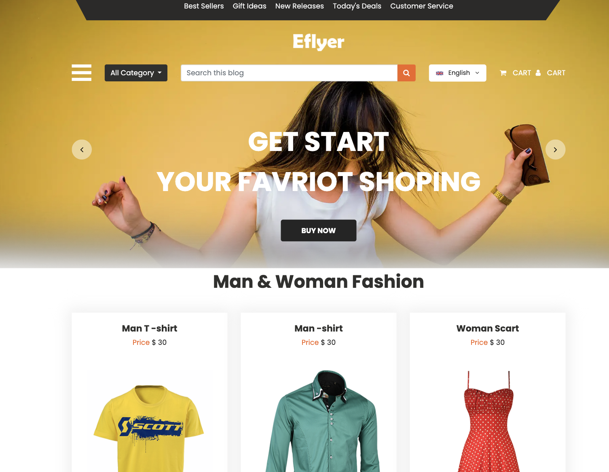

# Elevate Frontend Assignment

Assignment solution for the position of Frontend Developer for Elevate

View the live website here: [https://elevate-frontend-assignment.netlify.app/](https://elevate-frontend-assignment.netlify.app/)


## Features

- Uses ReactJS, React Hooks, React Context, CSS, and Javascript 
- Uses [Vite](https://vitejs.dev/) instead of CRA, thus is lighter and faster.
- Fully Responsive Design
- Reusable Components
## API Reference

#### Fake Store API

Fake store rest API for your e-commerce or shopping website prototype

Docs Link: [Fake Store API](https://fakestoreapi.com/docs)

```http
  GET https://fakestoreapi.com/products
```


## Usage

- Opening the application shows an e-commerce page design similar to the provided image as below.

    

- Fully functional sidebar is seen by clicking on the hamburger icon in the banner.
- The Categories dropdown filters products by categories that have been fetched from the API.
- The Search bar searches and filters products that have been searched.
- The Language Dropdown in the banner is non-functional and for display purposes only.
- The 'Cart' and 'Profile' buttons are non-functional and for display purposes only.
- The 'Buy Now' and 'See More' buttons on each product cards are non-functional and for display purposes only.
- The header on top is non functional and for display purposes only.
## Run Locally

Clone the project

```bash
  git clone https://github.com/rajsoni06/Elevate_Assignment
```

Go to the project directory

```bash
  cd elevate-frontend-assignment
```

Install dependencies

```bash
  npm install
  
  OR

  yarn install
```

Start the development server

```bash
  npm run dev
```
Open [http://127.0.0.1:5173/](http://127.0.0.1:5173/) to view it in your browser.

